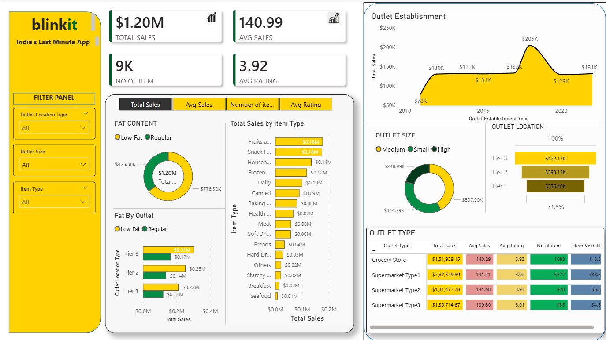

# 🛒 Blinkit Sales Analysis — Power BI Dashboard

  

  <b>India's Last Minute App — Grocery Retail Analytics</b>

---

## 📌 Problem Statement

Blinkit operates thousands of grocery outlets across multiple city tiers in India, catering to diverse consumer needs — from fresh produce to packaged goods. However, without a consolidated view of sales performance, outlet behaviour, and item-level trends, it becomes difficult to:

- Understand **which outlet types and locations** generate the most revenue
- Identify **top-performing item categories** and optimise product placement
- Evaluate how **outlet size, establishment year, and tier** impact sales and customer ratings
- Detect gaps in **fat content preferences** across different outlet locations
- Make **data-driven decisions** on expansion, restocking, and outlet strategy

This project delivers a single Power BI dashboard that answers all of the above — turning raw grocery transaction data into clear business intelligence.

---

## 🎯 Objective

> **To build an interactive Power BI dashboard for Blinkit's grocery sales data that enables stakeholders to explore total sales, outlet performance, item trends, and customer ratings — and extract actionable insights for growth.**

Specific goals:
- Track total and average sales, item count, and ratings across all outlets
- Compare **Low Fat vs Regular** product performance by outlet location
- Analyse **sales by item type** to identify the most and least profitable categories
- Examine **outlet establishment trends** from 2010 to 2022
- Benchmark **outlet types** (Grocery Store, Supermarket Type 1/2/3) across all KPIs
- Segment performance by **outlet size** (Small, Medium, High) and **location tier** (Tier 1/2/3)

---

## 📂 Dataset Information

| Attribute | Details |
|-----------|---------|
| **File** | `BlinkIT_Grocery_Data.xlsx` |
| **Records** | **8,523 transactions** |
| **Time Period** | Outlet establishment years 2011 – 2022 |
| **Tool Used** | Power BI (end-to-end) |

### Column Reference

| Column | Description |
|--------|-------------|
| `Item Fat Content` | Low Fat / Regular (with variants: LF, low fat, reg — cleaned in Power Query) |
| `Item Identifier` | Unique SKU code for each product |
| `Item Type` | Category (16 types: Fruits & Vegetables, Snack Foods, Household, etc.) |
| `Outlet Establishment Year` | Year the outlet was set up (2011–2022) |
| `Outlet Identifier` | Unique outlet code |
| `Outlet Location Type` | Tier 1, Tier 2, or Tier 3 city |
| `Outlet Size` | Small, Medium, or High |
| `Outlet Type` | Grocery Store / Supermarket Type 1 / 2 / 3 |
| `Item Visibility` | Shelf visibility score of the item |
| `Item Weight` | Weight of the item |
| `Sales` | Sales value (in USD) |
| `Rating` | Customer rating (1–5) |

### 16 Item Categories Covered
Fruits & Vegetables · Snack Foods · Household · Frozen Foods · Dairy · Canned Goods · Baking Goods · Health & Hygiene · Meat · Soft Drinks · Breads · Hard Drinks · Others · Starchy Foods · Breakfast · Seafood

---

## 🛠️ Tools & Technologies

| Tool | Purpose |
|------|---------|
| **Power BI Desktop** | Data loading, transformation, DAX measures, and full dashboard build |
| **Power Query (M Language)** | Data cleaning — standardising fat content labels (LF → Low Fat, reg → Regular), type casting, null handling |
| **DAX** | KPI calculations — Total Sales, Average Sales, Average Rating, Item Count |
| **Excel (.xlsx)** | Raw data source |

> **No Python or SQL was used in this project.** All data preparation and analysis was performed natively within Power BI using Power Query and DAX.

---

##  Dashboard

The dashboard is a **single-page, fully interactive report** with a filter panel and multiple chart types — designed to mirror Blinkit's brand identity (yellow & green).

### 🔢 Top-Level KPI Cards

| Metric | Value |
|--------|-------|
| 💰 Total Sales | **$1.20M** |
| 📦 Avg Sales per Item | **$140.99** |
| 🛍️ Number of Items | **9K** |
| ⭐ Avg Rating | **3.92** |

---

### 🎛️ Filter Panel

Three interactive slicers allow dynamic filtering across the entire dashboard:
- **Outlet Location Type** — All / Tier 1 / Tier 2 / Tier 3
- **Outlet Size** — All / Small / Medium / High
- **Item Type** — All / any of the 16 item categories

---

### 📈 Dashboard Sections

**1. Fat Content Analysis** — Donut chart breaking total sales by fat content:
- Low Fat: $425.36K · Regular: $776.32K

**2. Fat by Outlet (Location)** — Grouped bar showing fat split across tiers:
- Tier 3: $0.31M (Low Fat) · $0.17M (Regular)
- Tier 2: $0.25M (Low Fat) · $0.14M (Regular)
- Tier 1: $0.22M (Low Fat) · $0.12M (Regular)

**3. Total Sales by Item Type** — Ranked horizontal bar across 16 categories:
- 🥇 Fruits & Vegetables — $0.18M · 🥈 Snack Foods — $0.18M · 🥉 Household — $0.14M
- Lowest: Seafood — $0.01M · Breakfast — $0.02M

**4. Outlet Establishment Trend (2010–2022)** — Line/area chart:
- Grew from $78K (2010) → peaked at $205K (2018) → stabilised at ~$131K (2020–2022)

**5. Outlet Size** — Donut chart:
- Medium: $507.90K · Small: $444.79K · High: $248.99K

**6. Outlet Location (Tier)** — Horizontal bar:
- Tier 3: $472.13K · Tier 2: $393.15K · Tier 1: $336.40K

**7. Outlet Type Comparison Table:**

| Outlet Type | Total Sales | Avg Sales | Avg Rating | No. of Items | Item Visibility |
|-------------|------------|-----------|------------|--------------|-----------------|
| Grocery Store | $1,51,939 | 140.29 | 3.93 | 1,083 | 113.5 |
| Supermarket Type1 | $7,87,550 | 141.21 | 3.92 | 5,577 | 338.6 |
| Supermarket Type2 | $1,31,478 | 141.68 | 3.93 | 928 | 56.6 |
| Supermarket Type3 | $1,30,715 | 139.80 | 3.91 | 935 | 54.8 |

---

##  Key Insights

### Tier 3 Cities Are the Surprise Leaders
Tier 3 outlets generate **$472K** — 40% more than Tier 1 ($336K). This counter-intuitive finding suggests Blinkit has either more penetration or less competition in smaller cities, making Tier 3 expansion a high-priority growth lever.

###  Supermarket Type1 Is the Revenue Engine
At $787K (65%+ of total sales), Supermarket Type1 outlets dominate all other formats. Their average sales per item (141.21) is nearly identical to Grocery Stores (140.29), meaning scale — not per-unit efficiency — drives their advantage.

###  Medium Outlets Outperform High-Size Outlets
Medium-sized outlets ($507K) generate **2× the sales of High-sized outlets ($248K)**. This suggests diminishing returns on larger outlet investments — medium-format stores offer the best balance of cost and revenue.

###  Fruits & Vegetables and Snack Foods Lead Sales
Both categories tie at $0.18M each — together accounting for **30% of total item-type sales**. These are high-frequency, repeat-purchase categories that deserve maximum shelf space and promotional focus.

###  Regular Fat Products Dominate 65% of Sales
Despite health trends, Regular fat products ($776K) outsell Low Fat ($425K) by 82%. The mainstream consumer base strongly prefers regular fat products — though Low Fat has growth potential in health-forward Tier 1 markets.

###  2018-Established Outlets Are the Top Performers
The 2018 outlet cohort peaked at **$205K in sales** — double the 2011 cohort ($78K). Post-2020 outlets plateau at $129–131K, likely due to shorter operational maturity. This vintage effect is a key input for outlet lifecycle planning.

###  All Outlet Types Are Stuck at ~3.92 Rating
Every outlet type clusters between 3.91–3.93 — signalling a **platform-wide satisfaction ceiling**. Improvements in delivery speed, app UX, or product freshness guarantees could be the lever to break past 4.0.

###  Seafood and Breakfast Are Chronic Underperformers
At just $0.01M and $0.02M respectively, these categories likely cost more to maintain (cold chain, spoilage, low sell-through) than they return — prime candidates for SKU rationalisation.

---

##  Business Recommendations

> Strategic actions for Blinkit's category, outlet, and expansion teams.

### 1.  Double Down on Tier 3 Expansion
Tier 3 cities already outperform Tier 1 by 40% in total sales. Prioritise new outlet launches in underserved Tier 3 cities before competitors establish presence. Lower real estate costs combined with higher sales volumes make the unit economics compelling for aggressive expansion.

### 2.  Standardise on Medium-Format Supermarket Type1 Outlets
Medium-sized Supermarket Type1 outlets deliver the best combination of total sales volume and per-item efficiency. New capex should be directed toward this format over large "High" outlets that underperform proportionally.

### 3.  Maximise Shelf Visibility for Fruits, Vegetables & Snack Foods
The top two item categories together drive $0.36M — 30% of total revenue. Boosting their app placement, promotional slots, and physical shelf visibility could yield a disproportionate revenue uplift due to their repeat-purchase nature.

### 4.  Test Premium Low Fat Lines in Tier 1 Cities
Tier 1 customers are the most likely early adopters of health-conscious products. Launch a curated Low Fat product range (organic, fortified, or branded health items) exclusively in Tier 1 outlets to test willingness-to-pay before scaling nationally.

### 5.  Break the 3.92 Rating Ceiling
Invest in initiatives that move ratings meaningfully: faster delivery SLAs, fresher produce guarantees, better app experience, or loyalty rewards for top-rated outlet visits. A jump from 3.92 to 4.1+ can significantly improve customer trust and repeat order rates.

### 6.  Rationalise Seafood and Breakfast SKUs
With less than $0.02M in combined sales, these categories generate more overhead (cold storage, spoilage, logistics complexity) than they return. Conduct a margin-per-SKU audit and redirect shelf space and capital toward proven top-5 categories.

### 7.  Launch an Outlet Maturity Acceleration Program
Post-2018 outlets plateau at $129–131K. A targeted acceleration program — hyperlocal marketing, new-customer promotions, and curated category assortments — specifically for outlets under 4 years old could fast-track their path to the $150K–$180K revenue band.

### 8. Enforce Standardised Data Entry at the Source
The raw dataset contained 5 variants of fat content labels (Low Fat, LF, low fat, Regular, reg), requiring manual Power Query cleaning. Implementing standardised dropdown fields at the POS or inventory management system level will ensure data quality scales cleanly as outlet count grows.

---

##  Business Impact

| Recommendation | Estimated Impact |
|----------------|-----------------|
| Tier 3 expansion (5 new outlets) | ~$400K–$500K additional annual revenue |
| Medium Supermarket Type1 format investment | Best ROI per sq. ft. in the portfolio |
| Fruits & Snacks visibility boost | 10–15% uplift in top category revenues |
| Seafood / Breakfast SKU rationalisation | 3–5% reduction in inventory carrying cost |
| Outlet maturity acceleration program | $150K+ revenue milestone 18–24 months sooner |
| Low Fat premium range in Tier 1 | New revenue stream, est. $30–50K in Year 1 |
| Rating improvement to 4.1+ | Est. 8–12% improvement in repeat order rate |

---

##  Conclusion

This Blinkit Sales Analysis project demonstrates the full power of **Power BI as a one-stop analytics platform** — from raw Excel ingestion and Power Query data cleaning, to DAX-powered KPI calculations, to a polished, brand-consistent interactive dashboard — built entirely without Python or SQL.

The analysis uncovers several non-obvious findings: Tier 3 cities outperforming Tier 1, medium outlets beating high-sized stores, and the surprising dominance of Regular fat products — all of which challenge conventional assumptions and offer Blinkit's strategy team a fresh lens on where to invest, what to cut, and how to grow.

With focused action on Tier 3 expansion, medium-format Supermarket Type1 rollout, and top-category visibility, **Blinkit is well-positioned to scale total sales from $1.20M toward $1.6M+** in the next planning cycle.

---

  <b>Built with Power BI · Excel</b> 
  <i>Data Analytics Portfolio Project | 2024</i>

